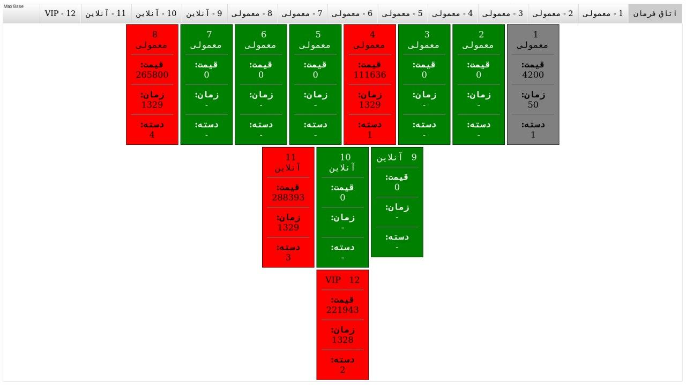
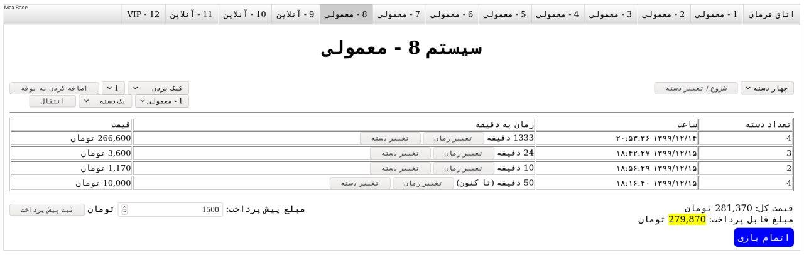
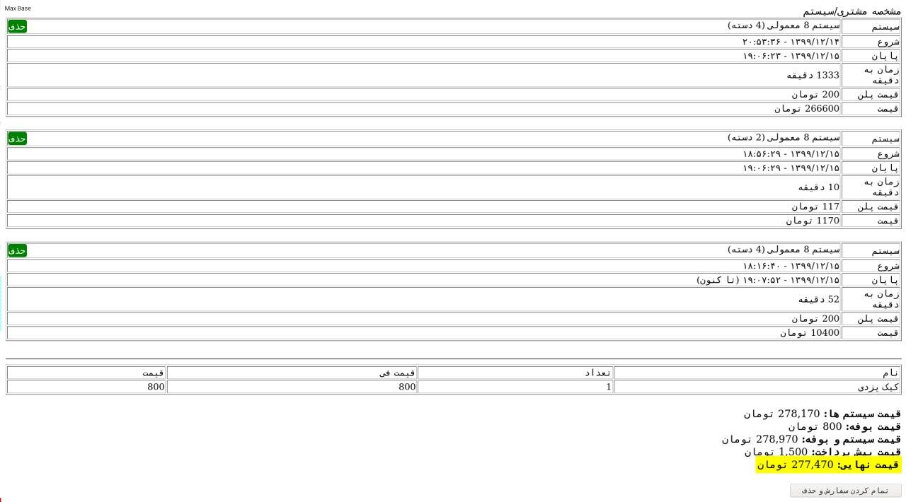

# Game Net System PHP

This is a complete system for game nets that can manage the category of console devices and also have control over rent and receiving money.
There is also a food/buffet management system next to the system and at the end an invoice is issued for each customer.

Working with this system is simple and the language is Persian.

This system was dynamic at first, but recently it was LIVE and the data is updated every few seconds. (XHR, Ajax and get data as JSON format)

Feel free to add style to tables and other parts. Any participation is appreciated.

© Copyright 2021. Max Base
